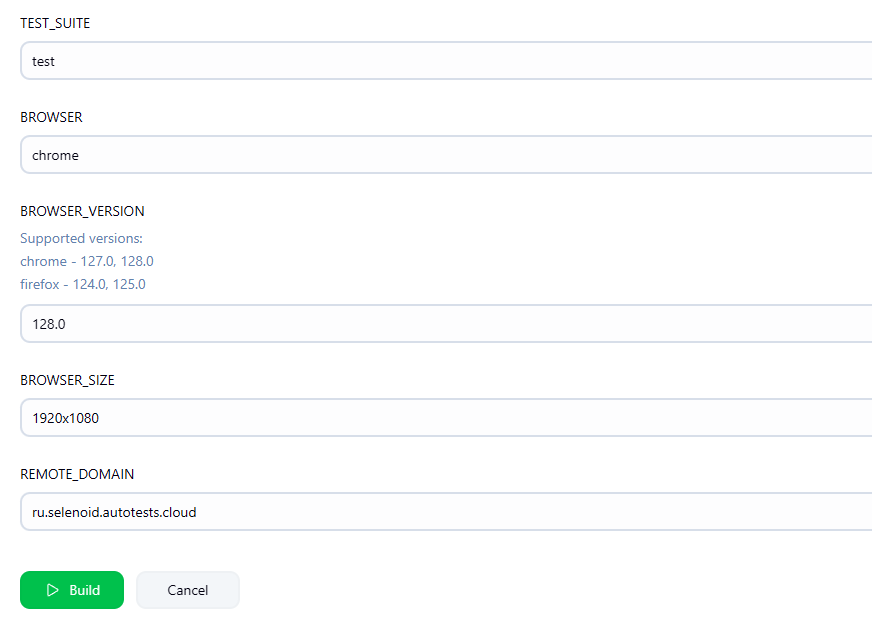
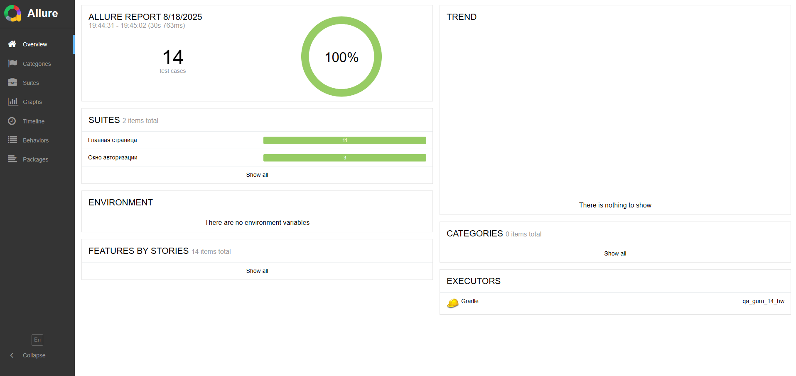
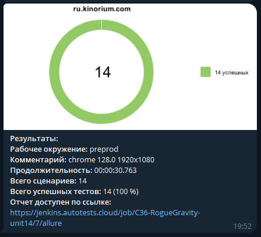
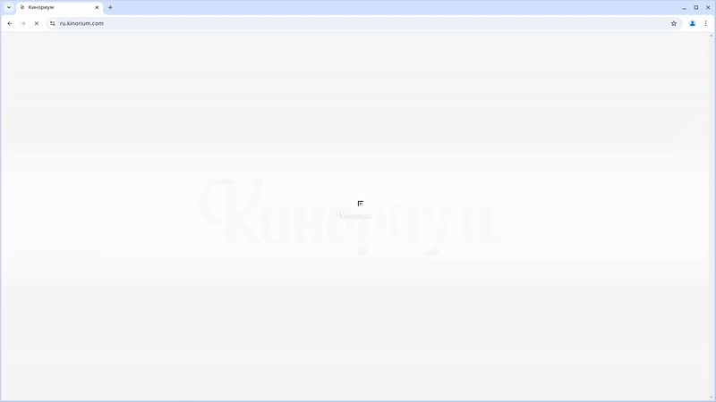

# Проект по автоматизации тестирования сайта [kinorium.com](https://ru.kinorium.com)


## **Содержание:**
____

* <a href="#tools">Технологии и инструменты</a>
* <a href="#jenkins">Сборка в Jenkins</a>
* <a href="#console">Запуск из терминала</a>
* <a href="#allure">Allure отчет</a>
* <a href="#telegram">Уведомление в Telegram </a>
* <a href="#video">Видео примера запуска тестов в Selenoid</a>
____

<a id="tools"></a>
## **Технологии и инструменты**

<p align="center">
<a href="https://www.jetbrains.com/idea/"></a> 
<a href="https://www.java.com/ru/"></a>
<a href="https://selenide.org/"></a>
<a href="https://aerokube.com/selenoid/"></a>
<a href="https://github.com/allure-framework"></a>
<a href="https://qameta.io/"></a>
<a href="https://gradle.org/"></a>
<a href="https://junit.org/junit5/"></a>
<a href="https://github.com/"></a>
<a href="https://www.jenkins.io/"></a>
<a href="https://web.telegram.org/"></a>
</p>


- Язык программирования:
    - [Java](https://www.java.com/)
- Фреймворки для тестирования:
    - [Selenide](https://selenide.org/)
    - [JUnit 5](https://junit.org/)
- Сборка и управление зависимостями: [Gradle](https://gradle.org/)
- Запуск браузеров в [Selenoid](https://aerokube.com/selenoid/) при прогоне тестов
- CI/CD: [Jenkins](https://www.jenkins.io/) (реализована джоба для удаленного запуска тестов с формированием Allure-отчета и отправкой результатов в <code>Telegram</code> при помощи бота)

Содержание Allure-отчета:
* Шаги теста;
* Скриншот страницы на последнем шаге;
* Page Source;
* Логи браузерной консоли;
* Видео выполнения автотеста.

____
<a id="jenkins"></a>
##  Сборка в [Jenkins](https://jenkins.autotests.cloud/job/036-ConstantinBesson-unit14)

Для запуска сборки необходимо перейти в раздел <code>Собрать с параметрами</code> и нажать кнопку <code>Собрать</code>.



____
<a id="console"></a>
## Запуск из терминала

```
./gradle clean test
```
При выполнении команды, тесты запустятся удаленно в [Selenoid](https://aerokube.com/selenoid/).

<code>clean</code> — удаляет каталог `build/` в проекте (все скомпилированные классы, отчёты, кэш тестов, временные файлы);

<code>test</code> — запускает задачу тестирования Gradle, которая:

- компилирует тесты и основной код;
- запускает тесты (JUnit, TestNG и т.д.);
- формирует отчёты (например, `build/reports/tests/test/index.html`).

***Удаленный запуск через Jenkins***

```
clean test
-Dbrowser=${BROWSER}
-DbrowserVersion=${BROWSER_VERSION}
-DbrowserSize=${BROWSER_SIZE}
-DremoteUrl=${REMOTE_URL}
```
***Параметры сборки в Jenkins***

- `browser` - браузер, в котором выполнятся тесты
- `browserVersion` - версия браузера
- `browserSize` - размер окна браузера, в котором будут выполняться тесты
- `remoteUrl` - полный адрес удаленного сервера, на котором будут запускаться тесты
- `remoteDomain` - адрес удаленного сервера, на котором будут запускаться тесты, для прикрепления видео к отчету
- 
____
<a id="allure"></a>
##  Пример [Allure-отчета](https://jenkins.autotests.cloud/job/036-ConstantinBesson-unit14/5/allure)



В отчете Allure представлены результаты тестирования с общей статистикой.
____
<a id="telegram"></a>
##  Уведомления в Telegram

После завершения сборки бот, созданный в Telegram, автоматически обрабатывает и отправляет сообщение с результатом.



____
<a id="video"></a>
##  Видео примера запуска тестов в Selenoid

К каждому тесту в отчете прилагается видео прогона.

